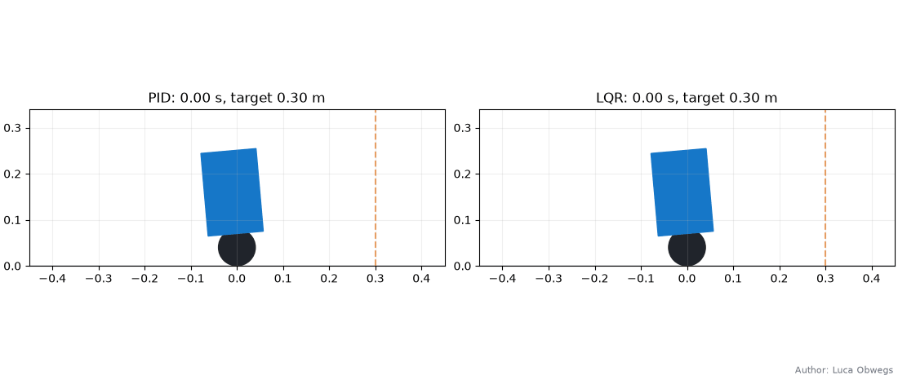
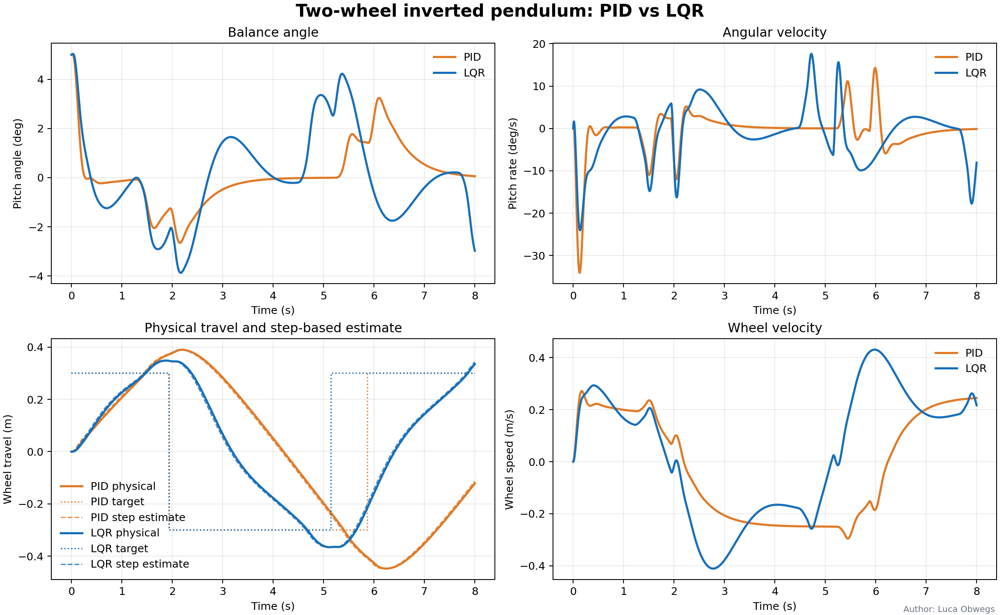
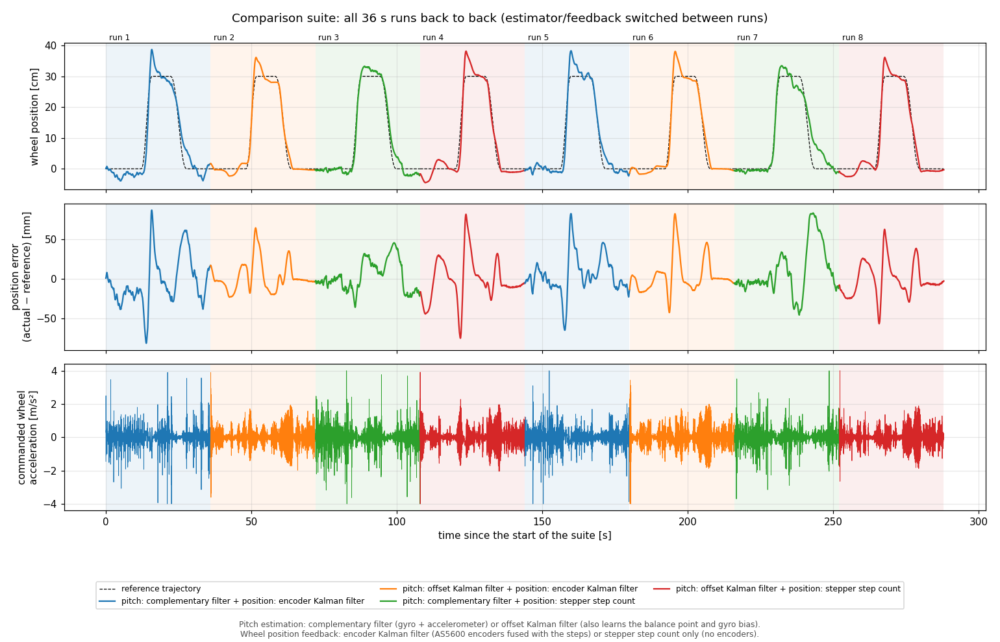
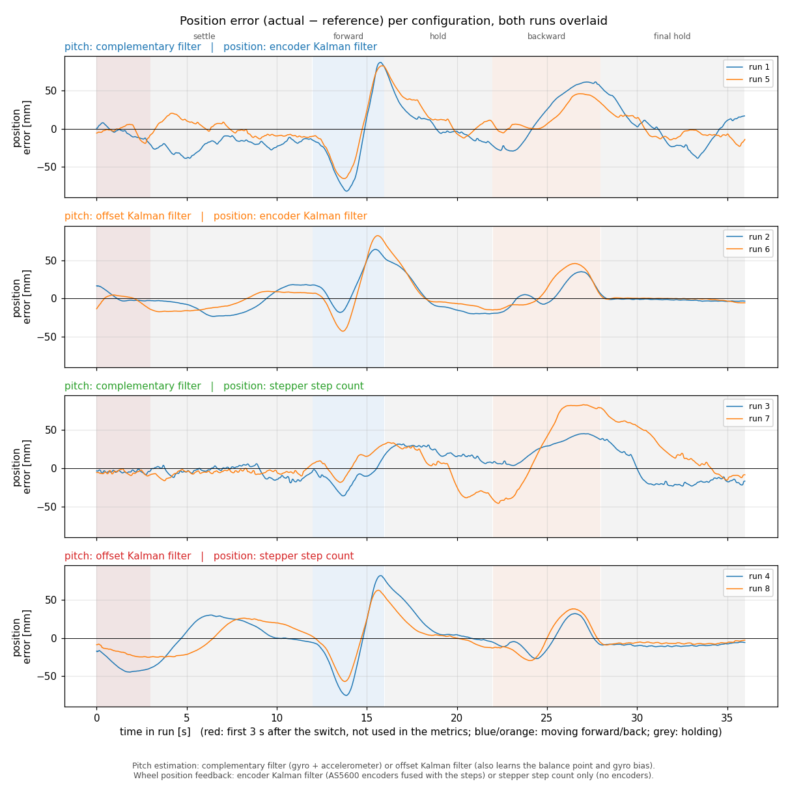
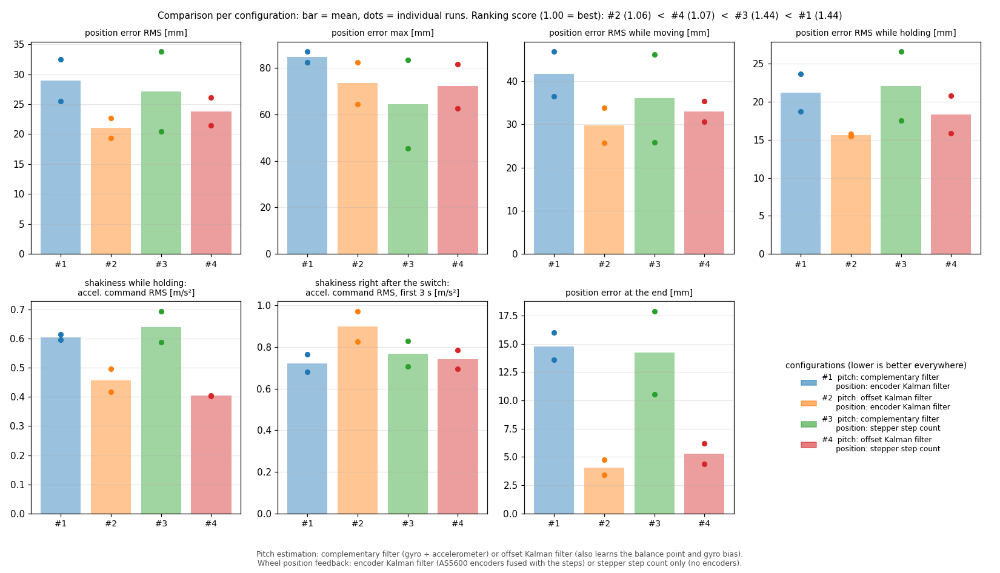
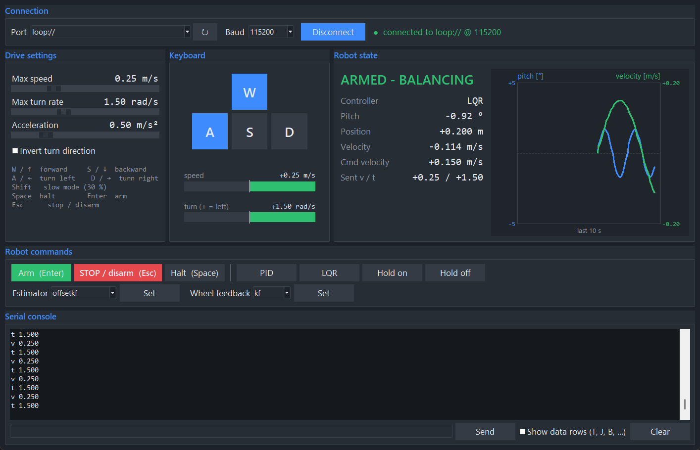

# Author: Luca Obwegs
# BalancingRobot

A two-wheel self-balancing robot built from:
- a NUCLEO-G474RE (STM32G474RE);
- an X-NUCLEO-IKS01A1 inertial board (LSM6DS0 accelerometer and gyro);
- two A4988 stepper drivers;
- two AS5600 magnetic wheel encoders.

The repository contains:

| Folder | Content |
|---|---|
| [simulation/](simulation/README.md) | Python model of the robot, PID vs LQR comparison (plots and animation), Gazebo Harmonic / ROS 2 simulation, firmware config export |
| [STM32Code/BalancingRobot/](STM32Code/BalancingRobot) | STM32CubeIDE / CubeMX firmware |
| [STM32Code/tests/](STM32Code/tests) | host test of the firmware against a simulated robot |
| [teleop/](teleop/README.md) | desktop app to drive the robot with the keyboard over UART |
| [docs/hardware_results/](docs/hardware_results) | plots of the estimator comparison measured on the robot |



## Quick start

1. Enter the measured mechanics in
   [simulation/config/mechanical.json](simulation/config/mechanical.json).
2. Compare the controllers in the simulation and export the gains to the
   firmware:
   ```powershell
   cd simulation
   python -m pip install -r requirements.txt
   python run_comparison.py
   python -m balancing_robot_sim.export_firmware_config
   ```
3. Build and flash `STM32Code/BalancingRobot` with STM32CubeIDE.
4. Power the robot while it stands upright and still; the IMU calibrates at
   boot.
5. Drive it with the [keyboard app](teleop/README.md):
   ```powershell
   python -m pip install -r teleop\requirements.txt
   python teleop\robot_teleop.py
   ```

## Simulation and controller comparison

The model is a wheeled inverted pendulum. The wheels follow a commanded
acceleration through a first-order motor lag (35 ms) and step-rate limits,
like the stepper motors. Both controllers command the wheel acceleration,
which is integrated into the wheel speed.

- **LQR**: five states `[∫position, position, velocity, pitch, pitch rate]`.
  The gains are computed from the mechanics in `mechanical.json`. The
  position integral learns the real balance point.
- **PID**: a pitch PD loop plus a velocity loop and a slow position hold:
  `a = kp·θ + kd·θ̇ + kv·(v − v_ref)`. The position error moves `v_ref`
  (limited to 0.05 m/s).



The plot shows a 5° start error followed by the −0.3 m / +0.3 m position
trajectory. Both controllers balance and reach both targets:

| 8 s run | PID | LQR |
|---|---:|---:|
| Pitch RMS | 1.24° | 1.86° |
| Peak pitch | 5.01° | 5.03° |
| Position RMS | 0.28 m | 0.23 m |

The PID controller holds the pitch more tightly. The LQR tracks the position
more closely and moves between the targets faster. Both settle to standstill.
Details, the Gazebo simulation and the motor/estimator model are in
[simulation/README.md](simulation/README.md).

### PID velocity-loop fix

The earlier PID used `a = kp·θ + kd·θ̇ − kv·(v − v_ref)`. With this sign the
velocity loop pushes the robot further: every lean drives the wheels faster
in the same direction, so the robot drifts away (7 m in 30 s without hold)
or falls with hold on. The old pitch gains (`kp = 250`, `kd = 5`) were also
unstable with the 35 ms motor lag.

A pole analysis of the linear model (position, wheel speed, lagged wheel
speed, pitch, pitch rate) gave the new gains `pitch_kp = 50`, `pitch_kd = 5`,
`velocity_kp = 6` and position hold `kp_s_inv = 1.0`:
- all poles stay stable for 0.35–3.85 times these gains;
- they stay stable for motor lags up to 80 ms;
- the LQR is stable for 0.50–2.95 times its gains and up to 85 ms lag.

The simulation and the firmware use the same fixed formula.

## STM32 firmware

Open `STM32Code/BalancingRobot/.project` in STM32CubeIDE. The CubeMX
peripheral setup is in `BalancingRobot.ioc`. All application code is in its
own files, called only from the `USER CODE` sections of `main.c` and
`stm32g4xx_it.c`. After regenerating with CubeMX, run
`python STM32Code/BalancingRobot/verify_cube_mx_user_code.py`. It checks that
the hooks are still in place.

### Pins and peripherals

| Function | Pin / peripheral |
|---|---|
| Left motor STEP | PA0 / TIM2_CH1 (PWM, 1 MHz timer clock) |
| Right motor STEP | PA8 / TIM1_CH1 (PWM, 1 MHz timer clock) |
| Left / right motor DIR | PA9 / PA10 |
| A4988 ENABLE 1 / 2 | PB0 / PA4, active low, disabled at boot |
| IMU (LSM6DS0) | I2C1, PB8 / PB9 (Arduino D15/D14) |
| Left AS5600 encoder | I2C3, PC8 SCL / PC9 SDA |
| Right AS5600 encoder | I2C4, PC6 SCL / PC7 SDA |
| Commands and telemetry | LPUART1 PA2 / PA3 (ST-LINK virtual COM port, 115200 8N1), TX with DMA |
| 500 Hz control tick | TIM6 interrupt |
| Watchdog | IWDG, 100 ms |

Interrupt priorities: TIM6 1, I2C1 2, I2C3/I2C4 and LPUART1 3. Use
3.3 V pull-ups (4.7 kΩ) on the encoder buses. Have an independent motor power
cutoff within reach; the software `stop` is not an emergency stop.

### Code structure

All application files are in `Core/Inc` and `Core/Src`:

| Module | Content |
|---|---|
| `robot_app.c` | init, the 500 Hz control tick (TIM6), command parser, telemetry, arming, turn split to the wheels |
| `controller.c` | PID and LQR with position hold |
| `estimator.c` | pitch estimators: complementary filter, pitch Kalman filter, balance-offset Kalman filter |
| `imu.c` | LSM6DS0 setup, boot calibration, conversion to the robot frame |
| `wheel_feedback.c` | wheel position/velocity from the step count or the wheel Kalman filters, encoder fallback |
| `wheel_kf.c` | two-state wheel Kalman filter (angle, speed) |
| `encoder.c` | interrupt-driven AS5600 reads with bus recovery |
| `stepper.c` | A4988 STEP PWM, DIR and ENABLE |
| `comm.c` | UART line receiver and DMA transmit queue |
| `fault.c` | latched fault reason |
| `robot_config.h` | board signs, sensor calibration, estimator and filter settings, boot defaults |
| `robot_config_generated.h` | gains, limits and plant constants exported from the simulation (do not edit) |

### Control loop

Every 2 ms (TIM6) the firmware:
1. reads the IMU;
2. updates the pitch estimator;
3. updates the wheel feedback; the encoder samples are read in the
   background by interrupt and collected one tick later;
4. runs PID or LQR;
5. sets the two step rates, adding ±ω·b/2 for the turn rate ω (b = wheel
   separation).

The robot falls over (fault `fall`) beyond 0.70 rad. A command expires after
0.5 s, so a lost link stops the robot.

### State estimation

**Pitch** (`estimator <mode>`):
- `offsetkf` (boot default): a 4-state Kalman filter
  `[pitch, pitch rate, gyro bias, balance point]`.
  - Its model is `θ̈ = α(θ − d) − cθ̇ − βa`, driven by the commanded wheel
    acceleration through the motor lag.
  - Measurements: `gyro = θ̇ + b` and `accel_pitch = θ − (a + h·θ̈)/g`.
  - It learns the balance point `d`, so the controller balances around
    `θ − d`. The LQR position integral then runs at 25 % only.
  - α, β and c come from the simulation (`ROBOT_PLANT_*`).
- `complementary`: complementary filter with the commanded acceleration
  removed from the accelerometer angle (`a/g`) and slow gyro-bias tracking
  while balancing.
- `kalman`: 2-state pitch/gyro-bias Kalman filter.

The complementary filter (or the `kalman` filter when selected) always runs as
well. Its pitch is used for the arming and fall checks and the telemetry.

**Wheel position and velocity** (`wheelfb <mode>`):
- `kf` (boot default): one Kalman filter per wheel.
  - States: `[angle, speed]`.
  - It predicts every 2 ms from the commanded step rate.
  - It corrects every 10 ms with the AS5600 angle, which is 2.3 ms old.
  - A stalled wheel (lost steps) is restarted from its measured speed.
- `steps`: position and velocity from the commanded steps.

If an encoder fails while balancing (10 failed reads in a row), the robot
keeps balancing on the step count and reports
`WHEELFB,FALLBACK,feedback=steps,reason=...,motors=STILL_ARMED`.

### Hardware results

The estimator combinations were compared on the robot with a repeated
0 → +0.3 m → 0 trajectory (LQR, hold on, 2 repetitions of each combination):





- The balance-offset KF clearly beat the complementary filter: the
  acceleration RMS while holding was 0.40–0.50 vs 0.59–0.69 m/s², and the
  final position error 4–5 vs 14–15 mm.
- The wheel KF tracked slightly better than the step count (21.0 vs 23.8 mm
  RMS); the step count was slightly smoother.
- The pitch Kalman filter (`kalman`) trusts the accelerometer more and was
  clearly shakier on the robot.

This is why `lqr`, `hold on`, `estimator offsetkf` and `wheelfb kf` are the
boot defaults.

### Serial commands

Send one command per line (`\r` or `\n`) at 115200 baud.

| Command | Effect |
|---|---|
| `arm` | enable the motors and balance; the pitch must be below 0.15 rad (`ARM,REJECTED,hold_upright` otherwise) |
| `stop` / `disarm` | disable the motors |
| `pid` / `lqr` | select the controller |
| `v <m/s>` | forward speed, limited to ±0.8 m/s, expires after 0.5 s |
| `t <rad/s>` | turn rate (positive speeds up the right wheel), limited to ±4 rad/s, expires after 0.5 s |
| `hold [on\|off]` | position hold; query without argument |
| `estimator [complementary\|kalman\|offsetkf]` | pitch estimator; query without argument |
| `wheelfb [kf\|steps]` | wheel feedback; query without argument |

`hold`, `estimator` and `wheelfb` can only be changed while stopped
(`...,REJECTED,stop_first`). The settings are kept in RAM only; boot
defaults are in `robot_config.h` and `mechanical.json`.

Telemetry at 10 Hz, armed and disarmed:

```text
T,pitch_e-4,position_e-4,velocity_e-4,command_velocity_e-4,controller,armed
```

pitch in rad, position in m and velocities in m/s, all scaled by 1e-4.
`controller` is 0 = PID, 1 = LQR.

A fault latches, disables the motors and is reported as `FAULT,<reason>`
until the board is reset. Reasons:
- `imu_no_ack`, `imu_id,0xNN` (expected 0x68), `imu_config`, `imu_calibration`, `imu`: IMU errors;
- `fall`: the robot fell over;
- `estimator`, `offset_kf`: numerical error in the estimators;
- `pwm_left`, `pwm_right`, `pwm`, `timer`: step timer errors;
- `uart_rx`, `tim6`, `timing`: start-up errors or a late control tick.

### Configuration

- Mechanics, gains, limits and the plant constants: edit
  `simulation/config/mechanical.json`, then run
  `python -m balancing_robot_sim.export_firmware_config` in `simulation/`.
  This writes `robot_config_generated.h`.
- Sensor axes and signs, accelerometer calibration, motor directions, filter
  noise settings and boot defaults: edit `robot_config.h`.

### Host test

[test_robot.c](STM32Code/tests/test_robot.c) runs the real firmware modules on
the PC. The HAL is mocked, and a pendulum model with an IMU lever arm and
AS5600 encoders replaces the robot. It checks:
- boot defaults, telemetry, command parsing and limits;
- the 0.5 s command timeout and the arming checks;
- teleop driving, turning and stopping with every controller / estimator /
  wheel feedback combination;
- encoder fallback and the fall fault.

Run from `STM32Code` with a host GCC (for example MinGW):

```powershell
$inc = '-IBalancingRobot\Core\Inc', '-isystem', 'BalancingRobot\Drivers\STM32G4xx_HAL_Driver\Inc',
       '-isystem', 'BalancingRobot\Drivers\CMSIS\Device\ST\STM32G4xx\Include',
       '-isystem', 'BalancingRobot\Drivers\CMSIS\Include'
gcc -O2 -Wall -Wextra -Werror -Wno-unused-parameter -DUSE_HAL_DRIVER -DSTM32G474xx @inc `
    tests\test_robot.c -o $env:TEMP\test_robot.exe -lm
& $env:TEMP\test_robot.exe
```

## Keyboard remote control

[teleop/](teleop/README.md) is a Tkinter app. Select the COM port and drive
with W/A/S/D or the arrow keys. It shows the robot state, a live chart of
pitch and velocity, and a serial console.



## Tests

```powershell
cd simulation; python -m unittest discover -s tests; cd ..
python -m unittest discover -s teleop -p "test_*.py"
```

The firmware host test is described above.
