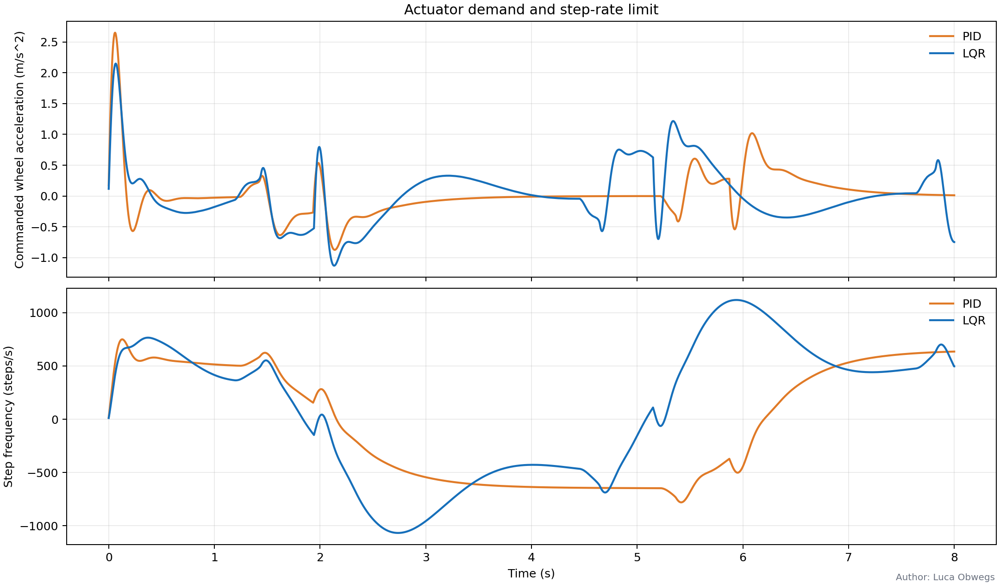

# Author: Luca Obwegs

# Balancing robot simulation

This package contains:
- an analytical model of the two-wheel inverted pendulum, used for the
  PID/LQR comparison, the plots and the animation;
- a ROS 2 Jazzy / Gazebo Harmonic simulation with keyboard teleoperation
  (Ubuntu 24.04; Gazebo does not run on native Windows);
- the export of gains, limits and plant constants to the firmware.

The simulation and the firmware share the same controller equations
(`balancing_robot_sim/control.py` and `Core/Src/controller.c`).

## Controller comparison, plots and animation

Run from this folder:

```bash
python -m pip install -r requirements.txt
python run_comparison.py
```

Options: `--config` (default `config/mechanical.json`), `--duration`
(default 8 s) and `--initial-pitch-deg` (default 5°).

The robot starts with a 5° lean and then follows the trajectory from
`mechanical.json` (−0.3 m ↔ +0.3 m). The results are written to `results/`:

| File | Content |
|---|---|
| `controller_comparison.png` | pitch, pitch rate, wheel travel (physical, target and step estimate), wheel speed |
| `control_effort.png` | commanded wheel acceleration and step frequency |
| `balancing_animation.gif` | side view of both controllers in real time |
| `summary.json` | pitch RMS and peak, position RMS, reached targets, final error, LQR gains |




The model is nonlinear and deterministic. It includes:
- the motor lag;
- the speed, acceleration and step-rate limits;
- step quantisation;
- the step-count position estimate the controller sees.

A fall is declared beyond `fall_angle_rad`.

### Controllers

Both controllers command the wheel acceleration `a`, which is integrated into
the wheel speed sent to the stepper motors.

- **LQR** uses `[∫x, x, v, θ, θ̇]`. The gains are computed with
  `lqr_q`/`lqr_r` from the mechanics, so they change when the mechanics
  change. The integral learns the real balance point (limited to
  `max_learned_trim_deg`).
- **PID** uses `a = kp·θ + ki·∫θ + kd·θ̇ + kv·(v − v_ref)`. With position hold
  the position error shifts `v_ref` by `−kp_s_inv·x`, limited to
  `max_correction_speed_m_s`.

The velocity term must have a **positive** sign. A lean forward then
accelerates the wheels a bit more, which is what brings the robot back
upright while it slows down; with a negative sign the robot runs away. The
PID gains (`pitch_kp` 50, `pitch_kd` 5, `velocity_kp` 6, `kp_s_inv` 1.0)
come from a pole analysis of the linear model with motor lag. They remain
stable for 0.35–3.85 times the gains and for motor lags up to 80 ms.

The test `test_pid_and_lqr_recover_and_settle` runs both controllers for 30 s
and checks that they settle at the start position.

## Mechanical parameters

All parameters are in [config/mechanical.json](config/mechanical.json):
- `robot`: masses, inertias, wheel size and separation, stepper step angle,
  microsteps, gear ratio, limits, motor lag, damping and friction;
- `control`: loop rate, LQR weights, PID gains, position hold, command
  timeout;
- `trajectory`: the automatic position trajectory.

Current mechanics:
- 62.5 mm wheels (66 g each), 182 mm apart, 1/16 microstepping, direct drive;
- body without wheels 885.5 g, made of a 160 g battery, two 265 g motors and
  195.5 g of chassis and electronics; total mass 1017.5 g.

The measured centre of mass is 54.5 mm above the axle, so the body centre of
mass is `1017.5 · 54.5 / 885.5 = 62.62 mm`.

The body pitch inertia `iyy` = 0.006999 kg m² is estimated from the parts as
blocks: `m·(l² + h²)/12 + m·(z − z_com)²` for each part.

| Part | Mass | Size front-back × axle × height (mm) | Height above axle (mm) |
|---|---:|---|---:|
| Battery | 160 g | 34 × 107 × 22.5 | 209.5 |
| Each motor | 265 g | 42 × 37.5 × 42 | 0 |
| Chassis / electronics | 195.5 g | 47 × 110 × 218 | 112.19 (from the measured COM) |

The body `ixx`/`izz`, the wheel inertias, the damping and the motor lag are
estimates.

### Export to the firmware

After changing the parameters, run in this folder:

```bash
python -m balancing_robot_sim.export_firmware_config
```

This regenerates `STM32Code/BalancingRobot/Core/Inc/robot_config_generated.h`:
- wheel geometry and step size;
- limits, PID gains and position hold;
- the LQR gains;
- the plant constants α, β and c and the motor lag (used by the
  balance-offset Kalman filter).

Then rebuild the firmware. Sensor signs and motor directions depend on the
mounting; set them in `robot_config.h`.

## Gazebo simulation

Install ROS 2 Jazzy, Gazebo Harmonic, `ros-jazzy-ros-gz` and
`ros-jazzy-teleop-twist-keyboard`, then build from the repository root:

```bash
python3 -m venv .venv
source .venv/bin/activate
python -m pip install -r simulation/requirements.txt
source /opt/ros/jazzy/setup.bash
cd simulation
colcon build --symlink-install
source install/setup.bash
ros2 launch balancing_robot_sim simulation.launch.py controller:=lqr
```

Use `controller:=pid` for the PID controller. The launch file generates the
model SDF from `mechanical.json` and `models/balancing_robot/model.sdf.in`.
Gazebo runs in real time and the controller uses simulation time.

Drive the robot from a second terminal (with ROS and the workspace sourced):

```bash
ros2 run teleop_twist_keyboard teleop_twist_keyboard \
  --ros-args -r cmd_vel:=/balance/cmd_vel
```

`linear.x` is the forward speed and `angular.z` the turn rate. Without
keyboard input the robot follows the trajectory from `mechanical.json`, and
it resumes the trajectory after the commands time out. The controller uses
the IMU and the step-count odometry; the ideal Gazebo odometry is only
bridged for visualisation.

## Tests

```bash
python -m unittest discover -s tests -v
```

The tests check:
- the model and the LQR design;
- that both controllers balance and settle;
- the trajectory;
- the SDF generation and the firmware export.
